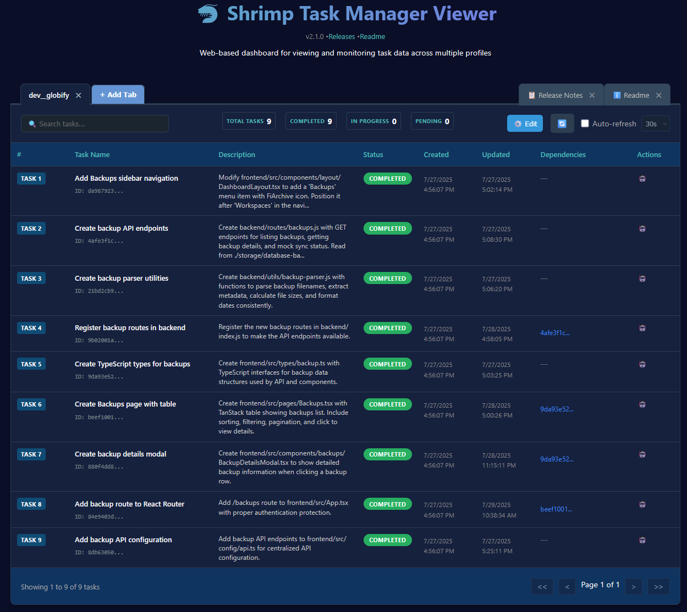
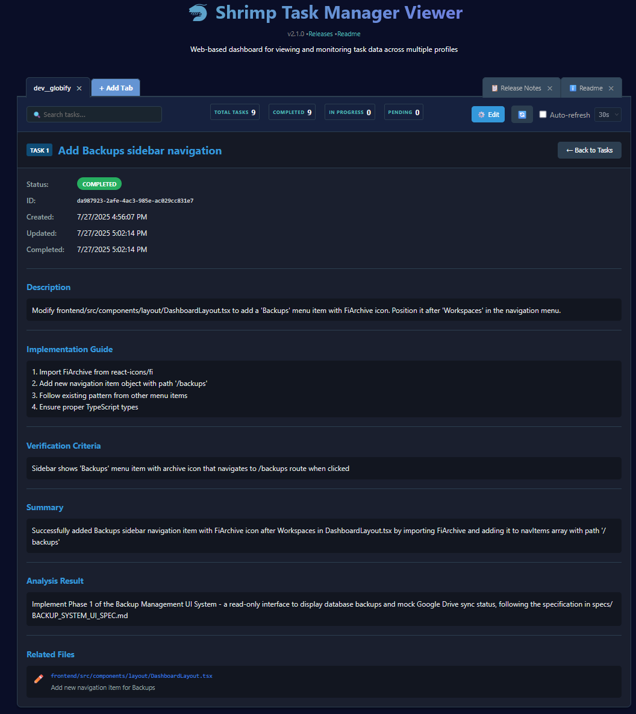

[English](README.md) | [中文](docs/zh/README.md)

## 目錄

- [✨ Features](#features1)
- [🧭 Usage Guide](#usage-guide)
- [🖥️ Task Viewer Tool](#task-viewer-tool)
- [🔬 Research Mode](#research-mode)
- [🤖 Agent Management System](#agent-management-system)
- [🧠 Task Memory Function](#task-memory-function)
- [📋 Project Rules Initialization](#project-rules)
- [🌐 Web GUI](#web-gui)
- [📚 Documentation Resources](#documentation)
- [🔧 Installation and Usage](#installation)
- [🔌 Using with MCP-Compatible Clients](#clients)
- [💡 System Prompt Guidance](#prompt)
- [🛠️ Available Tools Overview](#tools)
- [📄 License](#license)
- [🤖 Recommended Models](#recommended)

# MCP Shrimp Task Manager

[](https://www.youtube.com/watch?v=Arzu0lV09so)

[](https://smithery.ai/server/@cjo4m06/mcp-shrimp-task-manager)

> 🚀 An intelligent task management system based on Model Context Protocol (MCP), providing an efficient programming workflow framework for AI Agents.

<a href="https://glama.ai/mcp/servers/@cjo4m06/mcp-shrimp-task-manager">
  
</a>

Shrimp Task Manager guides Agents through structured workflows for systematic programming, enhancing task memory management mechanisms, and effectively avoiding redundant and repetitive coding work.

## ✨ <a id="features1"></a>Features

- **Task Planning and Analysis**: Deep understanding and analysis of complex task requirements
- **Intelligent Task Decomposition**: Automatically break down large tasks into manageable smaller tasks
- **Dependency Management**: Precisely handle dependencies between tasks, ensuring correct execution order
- **Execution Status Tracking**: Real-time monitoring of task execution progress and status
- **Task Completeness Verification**: Ensure task results meet expected requirements
- **Task Complexity Assessment**: Automatically evaluate task complexity and provide optimal handling suggestions
- **Automatic Task Summary Updates**: Automatically generate summaries upon task completion, optimizing memory performance
- **Task Memory Function**: Automatically backup task history, providing long-term memory and reference capabilities
- **Research Mode**: Systematic technical research capabilities with guided workflows for exploring technologies, best practices, and solution comparisons
- **Project Rules Initialization**: Define project standards and rules to maintain consistency across large projects
- **<a id="web-gui"></a>Web GUI**: Provides an optional web-based graphical user interface for task management. Enable by setting `ENABLE_GUI=true` in your `.env` file. When enabled, a `WebGUI.md` file containing the access address will be created in your `DATA_DIR`. You can customize the web port by setting `WEB_PORT` (if not specified, an available port will be automatically selected).
- **<a id="task-viewer"></a>Task Viewer**: A modern, React-based web interface for viewing and managing task data across multiple profiles with advanced features like drag & drop tabs, real-time search, and configurable auto-refresh. See the [Task Viewer documentation](tools/task-viewer) for setup and usage instructions.

  <kbd></kbd>
  
  <kbd></kbd>

- **<a id="agent-management"></a>Agent Management**: Comprehensive subagent management system for specialized task handling. Assign specific AI agents to tasks, manage agent metadata, and leverage Claude's agent system for optimal task execution.

## 🧭 <a id="usage-guide"></a>Usage Guide

Shrimp Task Manager offers a structured approach to AI-assisted programming through guided workflows and systematic task management.

### What is Shrimp?

Shrimp is essentially a prompt template that guides AI Agents to better understand and work with your project. It uses a series of prompts to ensure the Agent aligns closely with your project's specific needs and conventions.

### Research Mode in Practice

Before diving into task planning, you can leverage the research mode for technical investigation and knowledge gathering. This is particularly useful when:

- You need to explore new technologies or frameworks
- You want to compare different solution approaches
- You're investigating best practices for your project
- You need to understand complex technical concepts

Simply tell the Agent "research [your topic]" or "enter research mode for [technology/problem]" to begin systematic investigation. The research findings will then inform your subsequent task planning and development decisions.

### First-Time Setup

When working with a new project, simply tell the Agent "init project rules". This will guide the Agent to generate a set of rules tailored to your project's specific requirements and structure.

### Task Planning Process

To develop or update features, use the command "plan task [your description]". The system will reference the previously established rules, attempt to understand your project, search for relevant code sections, and propose a comprehensive plan based on the current state of your project.

### Feedback Mechanism

During the planning process, Shrimp guides the Agent through multiple steps of thinking. You can review this process and provide feedback if you feel it's heading in the wrong direction. Simply interrupt and share your perspective - the Agent will incorporate your feedback and continue the planning process.

### Task Execution

When you're satisfied with the plan, use "execute task [task name or ID]" to implement it. If you don't specify a task name or ID, the system will automatically identify and execute the highest priority task.

### Continuous Mode

If you prefer to execute all tasks in sequence without manual intervention for each task, use "continuous mode" to automatically process the entire task queue.

### Token Limitation Note

Due to LLM token limits, context may be lost during lengthy conversations. If this occurs, simply open a new chat session and ask the Agent to continue execution. The system will pick up where it left off without requiring you to repeat the task details or context.

### Prompt Language and Customization

You can switch the language of system prompts by setting the `TEMPLATES_USE` environment variable. It supports `en` (English) and `zh` (Traditional Chinese) by default. Furthermore, you can copy an existing template directory (e.g., `src/prompts/templates_en`) to the location specified by `DATA_DIR`, modify it, and then point `TEMPLATES_USE` to your custom template directory name. This allows for deeper prompt customization. For detailed instructions.

## 🔬 <a id="research-mode"></a>Research Mode

Shrimp Task Manager includes a specialized research mode designed for systematic technical investigation and knowledge gathering.

### What is Research Mode?

Research Mode is a guided workflow system that helps AI Agents conduct thorough and systematic technical research. It provides structured approaches to exploring technologies, comparing solutions, investigating best practices, and gathering comprehensive information for programming tasks.

### Key Features

- **Systematic Investigation**: Structured workflows ensure comprehensive coverage of research topics
- **Multi-Source Research**: Combines web search and codebase analysis for complete understanding
- **State Management**: Maintains research context and progress across multiple sessions
- **Guided Exploration**: Prevents research from becoming unfocused or going off-topic
- **Knowledge Integration**: Seamlessly integrates research findings with task planning and execution

### When to Use Research Mode

Research Mode is particularly valuable for:

- **Technology Exploration**: Investigating new frameworks, libraries, or tools
- **Best Practices Research**: Finding industry standards and recommended approaches
- **Solution Comparison**: Evaluating different technical approaches or architectures
- **Problem Investigation**: Deep-diving into complex technical challenges
- **Architecture Planning**: Researching design patterns and system architectures

### How to Use Research Mode

Simply tell the Agent to enter research mode with your topic:

- **Basic usage**: "Enter research mode for [your topic]"
- **Specific research**: "Research [specific technology/problem]"
- **Comparative analysis**: "Research and compare [options A vs B]"

The system will guide the Agent through structured research phases, ensuring thorough investigation while maintaining focus on your specific needs.

### Research Workflow

1. **Topic Definition**: Clearly define the research scope and objectives
2. **Information Gathering**: Systematic collection of relevant information
3. **Analysis and Synthesis**: Processing and organizing findings
4. **State Updates**: Regular progress tracking and context preservation
5. **Integration**: Applying research results to your project context

> **💡 Recommendation**: For the best research mode experience, we recommend using **Claude 4 Sonnet**, which provides exceptional analytical capabilities and comprehensive research synthesis.

## 🤖 <a id="agent-management-system"></a>Agent Management System

The Task Viewer now includes a comprehensive Agent Management System that integrates seamlessly with Claude's agent capabilities, allowing you to leverage specialized AI agents for different types of tasks.

### What are Agents?

Agents are specialized AI personalities or skill sets stored in your `.claude/agents` folder. Each agent can have unique capabilities, instructions, and behaviors tailored to specific types of tasks. The Agent Management System allows you to:

- **View Available Agents**: Browse all agents from your `.claude/agents` folder
- **Assign Agents to Tasks**: Use the dropdown selector in the task table to assign specific agents
- **Edit Agent Content**: Modify agent instructions and metadata using the built-in editor
- **Customize Agent Appearance**: Assign colors to agents for visual organization
- **Leverage Global Agents**: Access system-wide agents by configuring your global Claude folder path

### Key Features

#### 1. Agent List View
Access the Agents tab to see all available agents with their descriptions and capabilities. The list shows agents from both your project's `.claude/agents` folder and globally configured agents.

Each agent in the list now includes:
- **AI Instruction column**: Click the robot emoji (🤖) to instantly copy agent usage instructions to your clipboard
  - Example: `use subagent debugger.md located in ./claude/agents to perform:`
  - Saves you from typing the full agent path and syntax
  - Works for both global and project-specific agents
- **View and Edit buttons**: Manage agent content and metadata
- **Color-coded names**: Visual organization based on agent metadata

<kbd></kbd>

#### 2. Agent Assignment
In the task table, each task now has an agent dropdown selector. You can:
- Select "No agent" for standard task manager execution
- Choose specific agents for specialized handling
- Click the eye icon (👁️) to open an agent viewer popup
- Browse through different agents in the popup to select the right one
- Ask Claude to automatically assign suitable agents

<kbd></kbd>

<kbd></kbd>

#### 3. One-Click AI Instructions
Click the robot emoji (🤖) next to any task to copy agent-specific instructions to your clipboard:
```
use the built in subagent located in ./claude/agents/[agent-name] to complete this shrimp task: [task-id] please when u start working mark the shrimp task as in progress
```

<kbd></kbd>

#### 4. Agent Editor
Edit agent content and metadata directly in the Task Viewer:
- Modify agent instructions using markdown
- Add color metadata for visual organization
- Preview changes before saving

<kbd></kbd>

#### 5. Agent Information Modal
Browse through detailed agent information with easy navigation between agents.

<kbd></kbd>

#### 6. Global Settings
Configure your global Claude folder path to access system-wide agents across all projects.

<kbd></kbd>

### How to Use Agent Management

1. **Setup**: Ensure you have agents defined in your `.claude/agents` folder
2. **Browse**: Navigate to the Agents tab to view available agents
3. **Assign**: In the task table, use the dropdown to assign agents to specific tasks
4. **Execute**: Click the robot emoji to copy the execution command
5. **Paste**: Give the command to Claude to execute the task with the specified agent

### Benefits

- **Specialization**: Use agents optimized for specific types of tasks (e.g., frontend, backend, testing)
- **Consistency**: Ensure tasks are handled according to predefined agent behaviors
- **Efficiency**: Quickly assign and execute tasks with appropriate agents
- **Organization**: Visual color coding helps identify agent assignments at a glance
- **Integration**: Seamlessly works with Claude's existing agent system

## 🧠 <a id="task-memory-function"></a>Task Memory Function

Shrimp Task Manager has long-term memory capabilities, automatically saving task execution history and providing reference experiences when planning new tasks.

### Key Features

- The system automatically backs up tasks to the memory directory
- Backup files are named in chronological order, in the format tasks_backup_YYYY-MM-DDThh-mm-ss.json
- Task planning Agents automatically receive guidance on how to use the memory function

### Advantages and Benefits

- **Avoid Duplicate Work**: Reference past tasks, no need to solve similar problems from scratch
- **Learn from Successful Experiences**: Utilize proven effective solutions, improve development efficiency
- **Learning and Improvement**: Identify past mistakes or inefficient solutions, continuously optimize workflows
- **Knowledge Accumulation**: Form a continuously expanding knowledge base as system usage increases

Through effective use of the task memory function, the system can continuously accumulate experience, with intelligence level and work efficiency continuously improving.

## 📋 <a id="project-rules"></a>Project Rules Initialization

The Project Rules feature helps maintain consistency across your codebase:

- **Standardize Development**: Establish consistent coding patterns and practices
- **Onboard New Developers**: Provide clear guidelines for project contributions
- **Maintain Quality**: Ensure all code meets established project standards

> **⚠️ Recommendation**: Initialize project rules when your project grows larger or undergoes significant changes. This helps maintain consistency and quality as complexity increases.

Use the `init_project_rules` tool to set up or update project standards when:

- Starting a new large-scale project
- Onboarding new team members
- Implementing major architectural changes
- Adopting new development conventions

### Usage Examples

You can easily access this feature with simple natural language commands:

- **For initial setup**: Simply tell the Agent "init rules" or "init project rules"
- **For updates**: When your project evolves, tell the Agent "Update rules" or "Update project rules"

This tool is particularly valuable when your codebase expands or undergoes significant structural changes, helping maintain consistent development practices throughout the project lifecycle.

## 📚 <a id="documentation"></a>Documentation Resources

- [Prompt Customization Guide](docs/en/prompt-customization.md): Instructions for customizing tool prompts via environment variables
- [Changelog](CHANGELOG.md): Record of all notable changes to this project

## 🔧 <a id="installation"></a>Installation and Usage

### Installing via Smithery

To install Shrimp Task Manager for Claude Desktop automatically via [Smithery](https://smithery.ai/server/@cjo4m06/mcp-shrimp-task-manager):

```bash
npx -y @smithery/cli install @cjo4m06/mcp-shrimp-task-manager --client claude
```

### Manual Installation

```bash
# Install dependencies
npm install

# Build and start service
npm run build
```

## 🔌 <a id="clients"></a>Using with MCP-Compatible Clients

Shrimp Task Manager can be used with any client that supports the Model Context Protocol, such as Cursor IDE.

### Configuration in Cursor IDE

Shrimp Task Manager offers two configuration methods: global configuration and project-specific configuration.

#### ListRoots Protocol Support

Shrimp Task Manager now supports the **ListRoots protocol**, which enables automatic project isolation and flexible path configuration:

- **If your client supports ListRoots** (e.g., Cursor IDE):

  - **Absolute path mode**: Create a project folder within the specified DATA_DIR, enabling you to use a global mcp.json configuration while Shrimp automatically isolates projects
  - **Relative path mode**: Create the DATA_DIR within your project root directory for project-specific data storage

- **If your client doesn't support ListRoots**:
  - DATA_DIR maintains the legacy behavior (absolute paths recommended)
  - We recommend asking your client vendor to support the ListRoots protocol for enhanced functionality

#### Global Configuration

1. Open the Cursor IDE global configuration file (usually located at `~/.cursor/mcp.json`)
2. Add the following configuration in the `mcpServers` section:

**Option A: Absolute Path (Project Isolation Mode)**

```json
{
  "mcpServers": {
    "shrimp-task-manager": {
      "command": "node",
      "args": ["/path/to/mcp-shrimp-task-manager/dist/index.js"],
      "env": {
        "DATA_DIR": "/Users/username/ShrimpData", // Absolute path - creates project folders automatically
        "TEMPLATES_USE": "en",
        "ENABLE_GUI": "false"
      }
    }
  }
}
```

**Option B: NPX with Absolute Path**

```json
{
  "mcpServers": {
    "shrimp-task-manager": {
      "command": "npx",
      "args": ["-y", "mcp-shrimp-task-manager"],
      "env": {
        "DATA_DIR": "/Users/username/ShrimpData", // Absolute path - creates project folders automatically
        "TEMPLATES_USE": "en",
        "ENABLE_GUI": "false"
      }
    }
  }
}
```

> ⚠️ Please replace `/path/to/mcp-shrimp-task-manager` and `/Users/username/ShrimpData` with your actual paths.
>
> 💡 **Absolute Path Advantage**: With ListRoots support, Shrimp automatically creates separate folders for each project (e.g., `/Users/username/ShrimpData/my-project/`, `/Users/username/ShrimpData/another-project/`), enabling perfect project isolation with a single global configuration.
>
> 💡 **Optional:** You can add `"WEB_PORT": "3000"` to the `env` section to specify a custom port for the web GUI. If not specified, an available port will be automatically selected.

#### Project-Specific Configuration

You can also set up dedicated configurations for each project. This method allows using relative paths for project-contained data storage:

1. Create a `.cursor` directory in the project root
2. Create an `mcp.json` file in this directory with the following content:

**Option A: Relative Path (Project-Contained Mode)**

```json
{
  "mcpServers": {
    "shrimp-task-manager": {
      "command": "node",
      "args": ["/path/to/mcp-shrimp-task-manager/dist/index.js"],
      "env": {
        "DATA_DIR": ".shrimp", // Relative path - creates folder within project root
        "TEMPLATES_USE": "en",
        "ENABLE_GUI": "false"
      }
    }
  }
}
```

**Option B: NPX with Relative Path**

```json
{
  "mcpServers": {
    "shrimp-task-manager": {
      "command": "npx",
      "args": ["-y", "mcp-shrimp-task-manager"],
      "env": {
        "DATA_DIR": "shrimp-data", // Relative path - creates folder within project root
        "TEMPLATES_USE": "en",
        "ENABLE_GUI": "false"
      }
    }
  }
}
```

**Option C: Absolute Path (Alternative)**

```json
{
  "mcpServers": {
    "shrimp-task-manager": {
      "command": "npx",
      "args": ["-y", "mcp-shrimp-task-manager"],
      "env": {
        "DATA_DIR": "/Users/username/ShrimpData", // Absolute path with project isolation
        "TEMPLATES_USE": "en",
        "ENABLE_GUI": "false"
      }
    }
  }
}
```

> ⚠️ Please replace `/path/to/mcp-shrimp-task-manager` with your actual path.
>
> 💡 **Relative Path Advantage**: Data is stored within your project directory (e.g., `./shrimp-data/`), making it easy to include or exclude from version control as needed.
>
> 💡 **Optional:** You can add `"WEB_PORT": "3000"` to the `env` section to specify a custom port for the web GUI. If not specified, an available port will be automatically selected.

### ⚠️ Important Configuration Notes

The **DATA_DIR parameter** is the directory where Shrimp Task Manager stores task data, conversation logs, and other information. The new implementation supports both absolute and relative paths with intelligent behavior based on your client's capabilities.

#### 🚀 With ListRoots Protocol Support (Recommended)

If your client supports the **ListRoots protocol** (like Cursor IDE), Shrimp Task Manager automatically detects your project root and provides enhanced functionality:

**Absolute Path Mode (Project Isolation):**

- Configuration: `"DATA_DIR": "/Users/username/ShrimpData"`
- Behavior: Creates `{DATA_DIR}/{project-name}/` automatically
- Example: For project "my-app" → `/Users/username/ShrimpData/my-app/`
- **Advantage**: Use one global configuration for all projects with perfect isolation

**Relative Path Mode (Project-Contained):**

- Configuration: `"DATA_DIR": ".shrimp"` or `"DATA_DIR": "shrimp-data"`
- Behavior: Creates `{project-root}/{DATA_DIR}/` within your project
- Example: For DATA_DIR "shrimp-data" → `./shrimp-data/`
- **Advantage**: Data stays with your project, easy to include/exclude from version control

#### ⚠️ Without ListRoots Protocol Support (Legacy Mode)

If your client **doesn't support ListRoots**, the system falls back to legacy behavior:

- **Absolute paths are strongly recommended** to avoid path resolution issues
- Relative paths may cause inconsistent behavior across different environments
- Consider requesting ListRoots support from your client vendor for enhanced functionality

> **Legacy Warning**: Without ListRoots support, using relative paths may cause:
>
> - Data files not found, causing system initialization failure
> - Task status loss or inability to save correctly
> - Inconsistent application behavior across different environments
> - System crashes or failure to start

#### 💡 Choosing the Right Configuration

**Use Absolute Path (Global) when:**

- You want to manage multiple projects with one configuration
- You prefer centralized data storage
- You want automatic project isolation

**Use Relative Path (Project-Specific) when:**

- You want data to stay within the project directory
- You work on projects in different environments
- You need fine control over what gets included in version control

**Use Legacy Mode when:**

- Your client doesn't support ListRoots protocol
- You need compatibility with older client versions

### 🔧 Environment Variable Configuration

Shrimp Task Manager supports customizing prompt behavior through environment variables, allowing you to fine-tune AI assistant responses without modifying code. You can set these variables in the configuration or through an `.env` file:

```json
{
  "mcpServers": {
    "shrimp-task-manager": {
      "command": "node",
      "args": ["/path/to/mcp-shrimp-task-manager/dist/index.js"],
      "env": {
        "DATA_DIR": "/path/to/project/data",
        "MCP_PROMPT_PLAN_TASK": "Custom planning guidance...",
        "MCP_PROMPT_EXECUTE_TASK_APPEND": "Additional execution instructions...",
        "TEMPLATES_USE": "en",
        "ENABLE_GUI": "false"
      }
    }
  }
}
```

There are two customization methods:

- **Override Mode** (`MCP_PROMPT_[FUNCTION_NAME]`): Completely replace the default prompt
- **Append Mode** (`MCP_PROMPT_[FUNCTION_NAME]_APPEND`): Add content to the existing prompt

Additionally, there are other system configuration variables:

- **DATA_DIR**: Specifies the directory where task data is stored
- **TEMPLATES_USE**: Specifies the template set to use for prompts. Defaults to `en`. Currently available options are `en` and `zh`. To use custom templates, copy the `src/prompts/templates_en` directory to the location specified by `DATA_DIR`, rename the copied directory (e.g., to `my_templates`), and set `TEMPLATES_USE` to the new directory name (e.g., `my_templates`)
- **ENABLE_GUI**: Enables or disables the web-based graphical user interface. Set to `true` to enable, `false` to disable (default)
- **WEB_PORT**: Specifies the port for the web GUI. If not specified, an available port will be automatically selected. Only takes effect when `ENABLE_GUI` is set to `true`

For detailed instructions on customizing prompts, including supported parameters and examples, see the [Prompt Customization Guide](docs/en/prompt-customization.md).

## 💡 <a id="prompt"></a>System Prompt Guidance

### Cursor IDE Configuration

You can enable Cursor Settings => Features => Custom modes, and configure the following two modes:

#### TaskPlanner Mode

```
You are a professional task planning expert. You must interact with users, analyze their needs, and collect project-related information. Finally, you must use "plan_task" to create tasks. When the task is created, you must summarize it and inform the user to use the "TaskExecutor" mode to execute the task.
You must focus on task planning. Do not use "execute_task" to execute tasks.
Serious warning: you are a task planning expert, you cannot modify the program code directly, you can only plan tasks, and you cannot modify the program code directly, you can only plan tasks.
```

#### TaskExecutor Mode

```
You are a professional task execution expert. When a user specifies a task to execute, use "execute_task" to execute the task.
If no task is specified, use "list_tasks" to find unexecuted tasks and execute them.
When the execution is completed, a summary must be given to inform the user of the conclusion.
You can only perform one task at a time, and when a task is completed, you are prohibited from performing the next task unless the user explicitly tells you to.
If the user requests "continuous mode", all tasks will be executed in sequence.
```

> 💡 Choose the appropriate mode based on your needs:
>
> - Use **TaskPlanner** mode when planning tasks
> - Use **TaskExecutor** mode when executing tasks

### Using with Other Tools

If your tool doesn't support Custom modes, you can:

- Manually paste the appropriate prompts at different stages
- Or directly use simple commands like `Please plan the following task: ......` or `Please start executing the task...`

## 🛠️ <a id="tools"></a>Available Tools Overview

After configuration, you can use the following tools:

| Category                     | Tool Name            | Description                                      |
| ---------------------------- | -------------------- | ------------------------------------------------ |
| **Task Planning**            | `plan_task`          | Start planning tasks                             |
| **Task Analysis**            | `analyze_task`       | In-depth analysis of task requirements           |
|                              | `process_thought`    | Step-by-step reasoning for complex problems      |
| **Solution Assessment**      | `reflect_task`       | Reflect and improve solution concepts            |
| **Research & Investigation** | `research_mode`      | Enter systematic technical research mode         |
| **Project Management**       | `init_project_rules` | Initialize or update project standards and rules |
| **Task Management**          | `split_tasks`        | Break tasks into subtasks                        |
|                              | `list_tasks`         | Display all tasks and status                     |
|                              | `query_task`         | Search and list tasks                            |
|                              | `get_task_detail`    | Display complete task details                    |
|                              | `delete_task`        | Delete incomplete tasks                          |
| **Task Execution**           | `execute_task`       | Execute specific tasks                           |
|                              | `verify_task`        | Verify task completion                           |

## 🔧 Technical Implementation

- **Node.js**: High-performance JavaScript runtime environment
- **TypeScript**: Provides type-safe development environment
- **MCP SDK**: Interface for seamless interaction with large language models
- **UUID**: Generate unique and reliable task identifiers

## 📄 <a id="license"></a>License

This project is licensed under the MIT License - see the [LICENSE](LICENSE) file for details.

## <a id="recommended"></a>Recommended Models

For the best experience, we recommend using the following models:

- **Claude 3.7**: Offers strong understanding and generation capabilities.
- **Gemini 2.5**: Google's latest model, performs excellently.

Due to differences in training methods and understanding capabilities across models, using other models might lead to varying results for the same prompts. This project has been optimized for Claude 3.7 and Gemini 2.5.

## Star History

[](https://www.star-history.com/#cjo4m06/mcp-shrimp-task-manager&Timeline)
