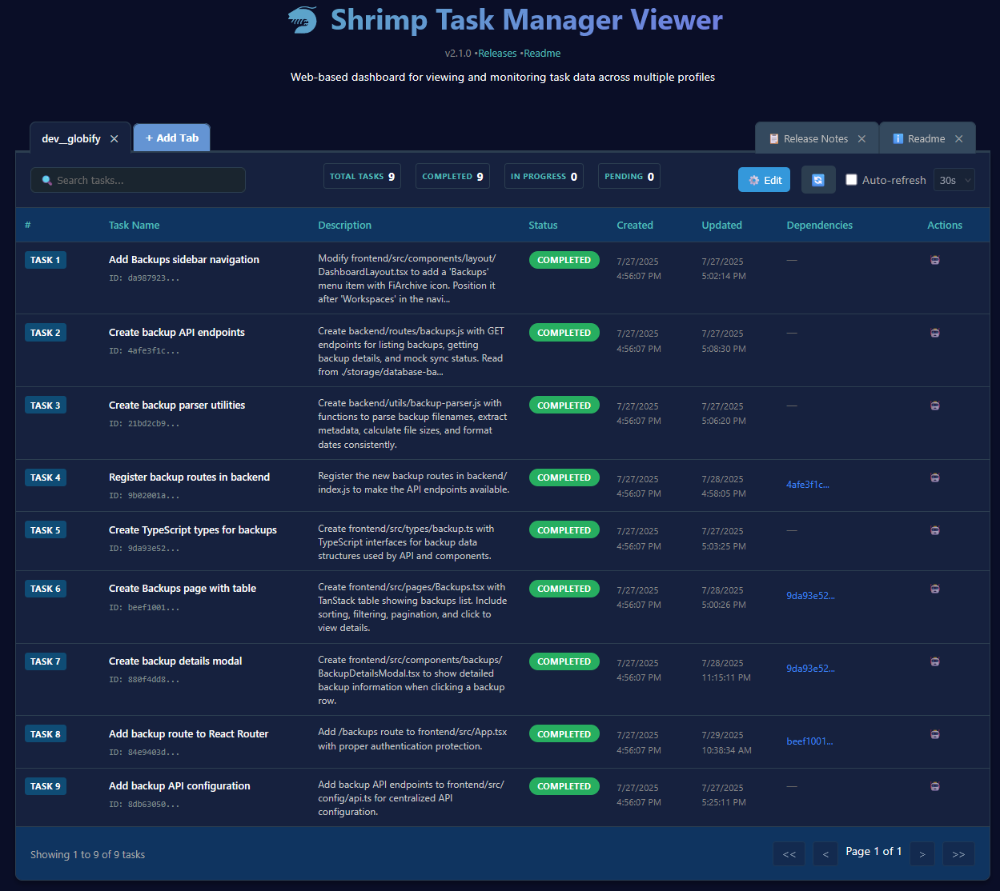
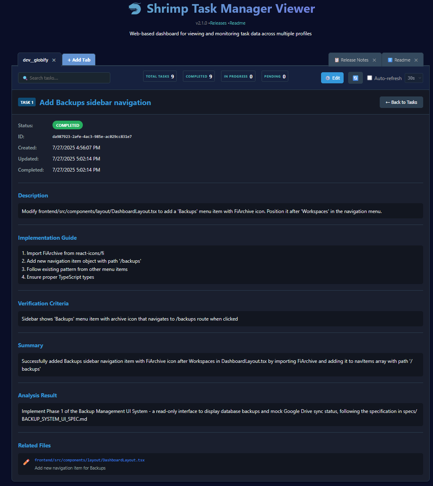

[🇺🇸 English](../../README.md) | [🇩🇪 Deutsch](../de/README.md) | [🇫🇷 Français](../fr/README.md) | [🇮🇳 हिंदी](README.md) | [🇮🇹 Italiano](../it/README.md) | [🇰🇷 한국어](../ko/README.md) | [🇧🇷 Português](../pt/README.md) | [🇷🇺 Русский](../ru/README.md) | [🇹🇭 ไทย](../th/README.md) | [🇹🇷 Türkçe](../tr/README.md) | [🇻🇳 Tiếng Việt](../vi/README.md) | [🇨🇳 中文](../zh/README.md)

## सामग्री तालिका

- [✨ विशेषताएं](#विशेषताएं1)
- [🧭 उपयोग गाइड](#उपयोग-गाइड)
- [🖥️ Task Viewer Tool](#task-viewer-tool)
- [🔬 अनुसंधान मोड](#अनुसंधान-मोड)
- [🤖 एजेंट प्रबंधन सिस्टम](#एजेंट-प्रबंधन-सिस्टम)
- [🧠 कार्य मेमोरी फंक्शन](#कार्य-मेमोरी-फंक्शन)
- [📋 प्रोजेक्ट नियम प्रारंभीकरण](#प्रोजेक्ट-नियम)
- [🌐 Web GUI](#web-gui)
- [📚 डॉक्यूमेंटेशन संसाधन](#डॉक्यूमेंटेशन)
- [🔧 इंस्टॉलेशन और उपयोग](#इंस्टॉलेशन)
- [🔌 MCP-संगत क्लाइंट्स के साथ उपयोग](#क्लाइंट्स)
- [💡 सिस्टम प्रॉम्प्ट गाइडेंस](#प्रॉम्प्ट)
- [🛠️ उपलब्ध टूल्स अवलोकन](#टूल्स)
- [🏗️ आर्किटेक्चर अवलोकन](#आर्किटेक्चर-अवलोकन)
- [📄 लाइसेंस](#लाइसेंस)
- [🤖 अनुशंसित मॉडल](#अनुशंसित-मॉडल)

# MCP Shrimp Task Manager

[](https://www.youtube.com/watch?v=Arzu0lV09so)

[](https://smithery.ai/server/@cjo4m06/mcp-shrimp-task-manager)

> 🚀 Model Context Protocol (MCP) पर आधारित एक बुद्धिमान कार्य प्रबंधन सिस्टम, जो AI Agents के लिए एक कुशल प्रोग्रामिंग वर्कफ़्लो फ्रेमवर्क प्रदान करता है।

<a href="https://glama.ai/mcp/servers/@cjo4m06/mcp-shrimp-task-manager">
  
</a>

Shrimp Task Manager एजेंट्स को व्यवस्थित प्रोग्रामिंग के लिए संरचित वर्कफ़्लो के माध्यम से मार्गदर्शन करता है, कार्य मेमोरी प्रबंधन तंत्र को बढ़ाता है, और अनावश्यक और दोहराव वाले कोडिंग कार्य से प्रभावी रूप से बचता है।

## ✨ <a id="विशेषताएं1"></a>विशेषताएं

- **कार्य नियोजन और विश्लेषण**: जटिल कार्य आवश्यकताओं की गहरी समझ और विश्लेषण
- **बुद्धिमान कार्य विघटन**: बड़े कार्यों को प्रबंधनीय छोटे कार्यों में स्वचालित रूप से तोड़ना
- **डिपेंडेंसी प्रबंधन**: कार्यों के बीच dependencies को सटीक रूप से संभालना, सही निष्पादन क्रम सुनिश्चित करना
- **निष्पादन स्थिति ट्रैकिंग**: कार्य निष्पादन प्रगति और स्थिति की वास्तविक समय निगरानी
- **कार्य पूर्णता सत्यापन**: सुनिश्चित करना कि कार्य परिणाम अपेक्षित आवश्यकताओं को पूरा करते हैं
- **कार्य जटिलता मूल्यांकन**: कार्य जटिलता का स्वचालित मूल्यांकन और इष्टतम हैंडलिंग सुझाव प्रदान करना
- **स्वचालित कार्य सारांश अपडेट**: कार्य पूर्णता पर स्वचालित सारांश जेनेरेशन, मेमोरी प्रदर्शन को अनुकूलित करना
- **कार्य मेमोरी फंक्शन**: कार्य इतिहास का स्वचालित बैकअप, दीर्घकालिक मेमोरी और संदर्भ क्षमताएं प्रदान करना
- **अनुसंधान मोड**: तकनीकों, सर्वोत्तम प्रथाओं, और समाधान तुलनाओं की खोज के लिए निर्देशित वर्कफ़्लो के साथ व्यवस्थित तकनीकी अनुसंधान क्षमताएं
- **प्रोजेक्ट नियम प्रारंभीकरण**: बड़े प्रोजेक्ट्स में निरंतरता बनाए रखने के लिए प्रोजेक्ट मानकों और नियमों को परिभाषित करना
- **<a id="web-gui"></a>Web GUI**: कार्य प्रबंधन के लिए एक वैकल्पिक वेब-आधारित ग्राफिकल यूजर इंटरफेस प्रदान करता है। अपनी `.env` फाइल में `ENABLE_GUI=true` सेट करके सक्षम करें। जब सक्षम हो, तो एक `WebGUI.md` फाइल आपकी `DATA_DIR` में एक्सेस पता के साथ बनाई जाएगी। आप `WEB_PORT` सेट करके वेब पोर्ट को कस्टमाइज़ कर सकते हैं (यदि निर्दिष्ट नहीं है, तो एक उपलब्ध पोर्ट स्वचालित रूप से चुना जाएगा)।
- **<a id="task-viewer"></a>Task Viewer**: एक आधुनिक, React-आधारित वेब इंटरफेस जो कई profiles में कार्य डेटा देखने और प्रबंधित करने के लिए drag & drop tabs, वास्तविक समय खोज, और कॉन्फ़िगरेबल auto-refresh जैसी उन्नत सुविधाओं के साथ है। सेटअप और उपयोग निर्देशों के लिए [Task Viewer documentation](../../tools/task-viewer) देखें।

  <kbd></kbd>
  
  <kbd></kbd>

- **<a id="agent-management"></a>एजेंट प्रबंधन**: विशेषीकृत कार्य हैंडलिंग के लिए व्यापक subagent प्रबंधन सिस्टम। विशिष्ट AI agents को कार्यों में assign करें, agent metadata को प्रबंधित करें, और इष्टतम कार्य निष्पादन के लिए Claude के agent system का लाभ उठाएं।

## 🧭 <a id="उपयोग-गाइड"></a>उपयोग गाइड

Shrimp Task Manager निर्देशित वर्कफ़्लो और व्यवस्थित कार्य प्रबंधन के माध्यम से AI-सहायक प्रोग्रामिंग के लिए एक संरचित दृष्टिकोण प्रदान करता है।

### Shrimp क्या है?

Shrimp मूल रूप से एक prompt template है जो AI Agents को आपके प्रोजेक्ट को बेहतर समझने और उसके साथ काम करने के लिए मार्गदर्शन करता है। यह Agent को आपके प्रोजेक्ट की विशिष्ट आवश्यकताओं और परंपराओं के साथ निकटता से संरेखित करने को सुनिश्चित करने के लिए prompts की एक श्रृंखला का उपयोग करता है।

### व्यवहार में अनुसंधान मोड

कार्य नियोजन में गोता लगाने से पहले, आप तकनीकी जांच और ज्ञान संग्रह के लिए अनुसंधान मोड का लाभ उठा सकते हैं। यह विशेष रूप से उपयोगी है जब:

- आपको नई तकनीकों या frameworks की खोज करनी होती है
- आप विभिन्न समाधान दृष्टिकोणों की तुलना करना चाहते हैं
- आप अपने प्रोजेक्ट के लिए सर्वोत्तम प्रथाओं की जांच कर रहे हैं
- आपको जटिल तकनीकी अवधारणाओं को समझना होता है

व्यवस्थित जांच शुरू करने के लिए बस Agent को "research [आपका विषय]" या "[तकनीक/समस्या] के लिए अनुसंधान मोड में प्रवेश करें" बताएं। अनुसंधान निष्कर्ष तब आपके बाद के कार्य नियोजन और विकास निर्णयों को सूचित करेंगे।

### पहली बार सेटअप

एक नए प्रोजेक्ट के साथ काम करते समय, बस Agent को "init project rules" बताएं। यह Agent को आपके प्रोजेक्ट की विशिष्ट आवश्यकताओं और संरचना के अनुकूल नियमों का एक सेट जेनेरेट करने के लिए मार्गदर्शन करेगा।

### कार्य नियोजन प्रक्रिया

सुविधाओं को विकसित या अपडेट करने के लिए, "plan task [आपका विवरण]" कमांड का उपयोग करें। सिस्टम पहले से स्थापित नियमों का संदर्भ लेगा, आपके प्रोजेक्ट को समझने का प्रयास करेगा, प्रासंगिक कोड sections की खोज करेगा, और आपके प्रोजेक्ट की वर्तमान स्थिति के आधार पर एक व्यापक योजना का प्रस्ताव करेगा।

### फीडबैक तंत्र

नियोजन प्रक्रिया के दौरान, Shrimp Agent को विचार के कई चरणों के माध्यम से मार्गदर्शन करता है। आप इस प्रक्रिया की समीक्षा कर सकते हैं और फीडबैक प्रदान कर सकते हैं यदि आपको लगता है कि यह गलत दिशा में जा रहा है। बस बीच में रोकें और अपना दृष्टिकोण साझा करें - Agent आपके फीडबैक को शामिल करेगा और नियोजन प्रक्रिया जारी रखेगा।

### कार्य निष्पादन

जब आप योजना से संतुष्ट हों, तो इसे लागू करने के लिए "execute task [कार्य नाम या ID]" का उपयोग करें। यदि आप कार्य नाम या ID निर्दिष्ट नहीं करते हैं, तो सिस्टम स्वचालित रूप से सबसे उच्च प्राथमिकता वाले कार्य की पहचान और निष्पादन करेगा।

### निरंतर मोड

यदि आप प्रत्येक कार्य के लिए मैन्युअल हस्तक्षेप के बिना सभी कार्यों को क्रम में निष्पादित करना पसंद करते हैं, तो पूरी कार्य queue को स्वचालित रूप से process करने के लिए "continuous mode" का उपयोग करें।

### टोकन सीमा नोट

LLM टोकन सीमाओं के कारण, लंबी बातचीत के दौरान context खो सकता है। यदि ऐसा होता है, तो बस एक नया chat session खोलें और Agent से निष्पादन जारी रखने को कहें। सिस्टम वहीं से उठाएगा जहां वह छोड़ा था, आपसे कार्य विवरण या context दोहराने की आवश्यकता के बिना।

### प्रॉम्प्ट भाषा और कस्टमाइज़ेशन

आप `TEMPLATES_USE` environment variable सेट करके सिस्टम prompts की भाषा को स्विच कर सकते हैं। यह डिफ़ॉल्ट रूप से `en` (अंग्रेजी) और `zh` (पारंपरिक चीनी) का समर्थन करता है। इसके अलावा, आप एक मौजूदा template directory (जैसे `src/prompts/templates_en`) को `DATA_DIR` द्वारा निर्दिष्ट स्थान पर कॉपी कर सकते हैं, इसे संशोधित कर सकते हैं, और फिर `TEMPLATES_USE` को अपने custom template directory name पर point कर सकते हैं। यह गहरी prompt customization की अनुमति देता है। विस्तृत निर्देशों के लिए।

## 🔬 <a id="अनुसंधान-मोड"></a>अनुसंधान मोड

Shrimp Task Manager में व्यवस्थित तकनीकी जांच और ज्ञान संग्रह के लिए डिज़ाइन किया गया एक विशेष अनुसंधान मोड शामिल है।

### अनुसंधान मोड क्या है?

अनुसंधान मोड एक निर्देशित वर्कफ़्लो सिस्टम है जो AI Agents को संपूर्ण और व्यवस्थित तकनीकी अनुसंधान करने में मदद करता है। यह तकनीकों की खोज, समाधानों की तुलना, सर्वोत्तम प्रथाओं की जांच, और प्रोग्रामिंग कार्यों के लिए व्यापक जानकारी एकत्र करने के लिए संरचित दृष्टिकोण प्रदान करता है।

### मुख्य विशेषताएं

- **व्यवस्थित जांच**: संरचित वर्कफ़्लो अनुसंधान विषयों की व्यापक कवरेज सुनिश्चित करते हैं
- **बहु-स्रोत अनुसंधान**: पूर्ण समझ के लिए वेब खोज और codebase विश्लेषण को जोड़ता है
- **स्थिति प्रबंधन**: कई sessions में अनुसंधान context और प्रगति बनाए रखता है
- **निर्देशित अन्वेषण**: अनुसंधान को unfocused होने या विषय से भटकने से रोकता है
- **ज्ञान एकीकरण**: अनुसंधान निष्कर्षों को कार्य नियोजन और निष्पादन के साथ seamlessly integrate करता है

### अनुसंधान मोड का उपयोग कब करें

अनुसंधान मोड विशेष रूप से मूल्यवान है:

- **तकनीक अन्वेषण**: नए frameworks, libraries, या tools की जांच
- **सर्वोत्तम प्रथाएं अनुसंधान**: उद्योग मानकों और अनुशंसित दृष्टिकोणों को खोजना
- **समाधान तुलना**: विभिन्न तकनीकी दृष्टिकोणों या architectures का मूल्यांकन
- **समस्या जांच**: जटिल तकनीकी चुनौतियों में गहराई से जाना
- **आर्किटेक्चर नियोजन**: डिज़ाइन patterns और system architectures का अनुसंधान

### अनुसंधान मोड का उपयोग कैसे करें

बस Agent को अपने विषय के साथ अनुसंधान मोड में प्रवेश करने को कहें:

- **बुनियादी उपयोग**: "[आपका विषय] के लिए अनुसंधान मोड में प्रवेश करें"
- **विशिष्ट अनुसंधान**: "[विशिष्ट तकनीक/समस्या] का अनुसंधान करें"
- **तुलनात्मक विश्लेषण**: "[विकल्प A बनाम B] का अनुसंधान और तुलना करें"

सिस्टम Agent को संरचित अनुसंधान phases के माध्यम से मार्गदर्शन करेगा, आपकी विशिष्ट आवश्यकताओं पर focus बनाए रखते हुए संपूर्ण जांच सुनिश्चित करेगा।

### अनुसंधान वर्कफ़्लो

1. **विषय परिभाषा**: अनुसंधान scope और objectives को स्पष्ट रूप से परिभाषित करना
2. **जानकारी संग्रह**: प्रासंगिक जानकारी का व्यवस्थित संग्रह
3. **विश्लेषण और संश्लेषण**: निष्कर्षों को process करना और organize करना
4. **स्थिति अपडेट**: नियमित प्रगति ट्रैकिंग और context preservation
5. **एकीकरण**: अनुसंधान परिणामों को आपके प्रोजेक्ट context में लागू करना

> **💡 सिफारिश**: सर्वोत्तम अनुसंधान मोड अनुभव के लिए, हम **Claude 4 Sonnet** का उपयोग करने की सिफारिश करते हैं, जो असाधारण विश्लेषणात्मक क्षमताएं और व्यापक अनुसंधान संश्लेषण प्रदान करता है।

## 🏗️ <a id="आर्किटेक्चर-अवलोकन"></a>आर्किटेक्चर अवलोकन

### मुख्य आर्किटेक्चर

MCP Shrimp Task Manager एक Model Context Protocol (MCP) server के रूप में बनाया गया है जो निर्देशित वर्कफ़्लो और व्यवस्थित कार्य विघटन के माध्यम से AI agents के लिए संरचित कार्य प्रबंधन क्षमताएं प्रदान करता है।

#### 1. **MCP Server Foundation**
- MCP protocol अनुपालन के लिए `@modelcontextprotocol/sdk` पर निर्मित
- AI clients के साथ communication के लिए stdio transport का उपयोग
- JSON Schema definitions के माध्यम से 16 विशेष tools expose करता है
- सिंक्रोनस और एसिंक्रोनस दोनों operations का समर्थन करता है

#### 2. **Task Data Model** (`src/types/index.ts`, `src/models/taskModel.ts`)
- **Task Entity**: unique ID, name, description, status, और dependencies के साथ मुख्य डेटा structure
- **Task States**: PENDING → IN_PROGRESS → COMPLETED (या BLOCKED)
- **Dependency Graph**: कार्य संबंधों और निष्पादन क्रम को प्रबंधित करता है
- **Related Files**: प्रत्येक कार्य से जुड़ी files को track करता है (TO_MODIFY, REFERENCE, CREATE, आदि)
- **Persistence**: पूर्ण इतिहास के लिए Git versioning के साथ JSON file storage
- **Memory System**: स्वचालित backups और दीर्घकालिक कार्य इतिहास preservation

#### 3. **Tool System Architecture** (`src/tools/`)
सिस्टम तीन मुख्य श्रेणियों में organize किए गए विशेष tools प्रदान करता है:

**कार्य प्रबंधन Tools:**
- `plan_task`: प्राकृतिक भाषा को संरचित विकास योजनाओं में परिवर्तित करता है
- `analyze_task`: जटिलता मूल्यांकन के साथ गहन तकनीकी विश्लेषण
- `split_tasks`: जटिल कार्यों का प्रबंधनीय subtasks में बुद्धिमान विघटन
- `execute_task`: चरणबद्ध निर्देशों के साथ निर्देशित implementation
- `verify_task`: पूर्णता सत्यापन और गुणवत्ता आश्वासन
- `list_tasks`, `query_task`, `get_task_detail`: कार्य inspection और retrieval
- `update_task`, `delete_task`, `clear_all_tasks`: कार्य manipulation

**संज्ञानात्मक Tools:**
- `process_thought`: जटिल समस्या समाधान के लिए chain-of-thought reasoning framework
- `reflect_task`: पूर्णता के बाद विश्लेषण और learning extraction
- `research_mode`: निर्देशित वर्कफ़्लो के साथ व्यवस्थित तकनीकी जांच

**प्रोजेक्ट Tools:**
- `init_project_rules`: प्रोजेक्ट-विशिष्ट conventions और standards स्थापित करता है

#### 4. **Prompt Template System** (`src/prompts/`)
- **बहु-भाषा समर्थन**: अंग्रेजी और पारंपरिक चीनी templates
- **Template-आधारित Generation**: मॉड्यूलर prompt construction
- **Context-aware Prompts**: कार्य स्थिति के आधार पर dynamic prompt generation
- **Customizable Templates**: environment variables के माध्यम से override या extend
- **Template Loading**: configuration के आधार पर dynamic template selection

#### 5. **Agent Integration System** (`src/utils/agentLoader.ts`)
- **Agent Assignment**: कार्यों को विशेष AI agents को assign किया जा सकता है
- **Agent Metadata**: agent capabilities और specializations store करता है
- **Agent Matching**: कार्य आवश्यकताओं के आधार पर intelligent agent selection
- **Claude Integration**: Claude के agent system के साथ seamless integration

### डेटा फ़्लो और वर्कफ़्लो

#### 1. **कार्य नियोजन Phase**
```
User Request → plan_task → analyze_task → split_tasks (यदि जटिल)
```
- प्राकृतिक भाषा को parse किया जाता है और संरचित कार्यों में परिवर्तित किया जाता है
- जटिलता मूल्यांकन निर्धारित करता है कि क्या कार्य splitting की आवश्यकता है
- Dependencies को स्वचालित रूप से पहचाना और mapped किया जाता है

#### 2. **निष्पादन Phase**
```
execute_task → Implementation Guide → Status Updates → File Tracking
```
- चरणबद्ध implementation guidance जेनरेट की जाती है
- संबंधित files track और monitor की जाती हैं
- प्रगति स्थिति real-time में update होती है
- version control के लिए Git commits बनाए जाते हैं

#### 3. **सत्यापन Phase**
```
verify_task → reflect_task → Task Summary → Memory Storage
```
- acceptance criteria के against पूर्णता सत्यापित की जाती है
- भविष्य के reference के लिए lessons learned extract किए जाते हैं
- कार्य सारांश जेनरेट और store किया जाता है
- Memory system भविष्य के कार्यों के लिए knowledge preserve करता है

#### 4. **Memory और Persistence**
- **Primary Storage**: DATA_DIR में `tasks.json`
- **Version Control**: Git repository सभी changes track करता है
- **Backup System**: स्वचालित timestamped backups
- **Memory Directory**: पूर्ण कार्यों का दीर्घकालिक storage
- **Project Isolation**: ListRoots protocol per-project डेटा separation enable करता है

### मुख्य डिज़ाइन सिद्धांत

1. **Chain-of-Thought Reasoning**: Tools AI को संरचित सोच processes के माध्यम से मार्गदर्शन करते हैं
2. **Iterative Refinement**: कार्यों को कई बार analyze, split, और refine किया जा सकता है
3. **Context Preservation**: Git history और memory system sessions में context loss को रोकते हैं
4. **भाषा लचीलापन**: customizable templates के साथ द्विभाषी समर्थन
5. **Stateful Management**: Persistent storage conversations के बीच कार्य स्थिति बनाए रखता है
6. **निर्देशित वर्कफ़्लो**: सिस्टम command करने के बजाय मार्गदर्शन करता है, निरंतरता सुनिश्चित करता है

### वेब इंटरफेस

#### 1. **Built-in Web GUI** (`src/web/webServer.ts`)
- वैकल्पिक Express.js server (ENABLE_GUI=true)
- वास्तविक समय कार्य visualization
- fallback के साथ Auto-port selection
- एक्सेस URL के साथ WebGUI.md जेनरेट करता है

#### 2. **Task Viewer Tool** (`tools/task-viewer/`)
- स्टैंडअलोन React application
- विभिन्न projects के लिए multi-profile समर्थन
- auto-refresh के साथ वास्तविक समय कार्य निगरानी
- organization के लिए drag-and-drop interface
- Agent management integration

### Integration Points

- **MCP Protocol**: AI model interaction के लिए मानक protocol
- **File System**: कार्य डेटा के लिए प्रत्यक्ष file manipulation
- **Git Integration**: कार्य इतिहास के लिए version control
- **Environment Variables**: व्यापक configuration विकल्प
- **Web APIs**: GUI interaction के लिए RESTful endpoints

## 🔧 तकनीकी Implementation

- **Node.js**: उच्च-प्रदर्शन JavaScript runtime environment
- **TypeScript**: type-safe विकास environment प्रदान करता है
- **MCP SDK**: बड़े भाषा मॉडल के साथ seamless interaction के लिए interface
- **UUID**: unique और विश्वसनीय कार्य identifiers जेनरेट करता है
- **Express.js**: वैकल्पिक GUI के लिए वेब server
- **Git**: कार्य इतिहास के लिए version control

## 📄 <a id="लाइसेंस"></a>लाइसेंस

यह प्रोजेक्ट MIT License के तहत licensed है - विवरण के लिए [LICENSE](../../LICENSE) फ़ाइल देखें।

## <a id="अनुशंसित-मॉडल"></a>अनुशंसित मॉडल

सर्वोत्तम अनुभव के लिए, हम निम्नलिखित मॉडल का उपयोग करने की सिफारिश करते हैं:

- **Claude 3.7**: मजबूत समझ और generation क्षमताएं प्रदान करता है।
- **Gemini 2.5**: Google का नवीनतम मॉडल, उत्कृष्ट प्रदर्शन करता है।

मॉडल में training methods और समझ क्षमताओं में अंतर के कारण, अन्य मॉडल का उपयोग समान prompts के लिए अलग परिणाम दे सकता है। यह प्रोजेक्ट Claude 3.7 और Gemini 2.5 के लिए अनुकूलित किया गया है।

## Star History

[](https://www.star-history.com/#cjo4m06/mcp-shrimp-task-manager&Timeline)